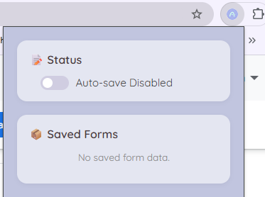

# AutoStash

WASM-powered browser extension in Rust that saves form progress into [chrome storage](https://developer.chrome.com/docs/extensions/reference/api/storage), so you don't have to refill the online forms if the submit button failed or browser crashed. Icon generatd with Google Gemini.

Tools You’ll Use:
- wasm-bindgen: for JS interop
- wasm-pack: to compile Rust to WebAssembly
- JavaScript wrapper to load the WASM module in your extension



## Test with Chrome Extension Developer mode
Build the wasm module
```
wasm-pack build --target web
```

Navigate to [Chrome extensions](chrome://extensions/), turn on Developer mode and load the module unpacked.

## Why this is a Rust library and not an executable

Rust project for your browser extension is a library (`lib`) instead of an executable (`bin`) has to do with how WebAssembly integrates into the browser.

When you compile Rust to WebAssembly for the web, you're not running a standalone binary (like you would with a CLI app). Instead:

- The browser loads your `.wasm` file like a module.

- JavaScript acts as the “main” runner.

- Your Rust code exposes functions using `#[wasm_bindgen]` so JS can call them.

- The Rust function `#[wasm_bindgen(start)]` acts like the “main” entry point, but this optional. It’s just a convenient hook for running initialization logic automatically when the WASM module is loaded (by calling the `init()` function in JavaScript which is automatically generated by `wasm-pack`.). You don’t need it if you're exporting functions and calling them from JS. Many extensions/modules avoid it to keep JS in full control of lifecycle.

So your crate needs to be a `cdylib`:
```rust
[lib]
crate-type = ["cdylib"]
```
This tells Rust to compile into a shared binary format that other languages (JS, in this case) can load, so it can interop with JS, be used in browser extensions, and works in browsers.

Rust executables (`[[bin]]`) compile to native machine code — not WebAssembly. Even if you tried to use `main.rs` and `fn main()`, it wouldn’t work in a browser because:

- Browsers don’t know how to run a native Rust binary.

- There's no terminal/CLI to invoke it.

- You need to interoperate with the DOM, events, etc., which requires JS integration.
